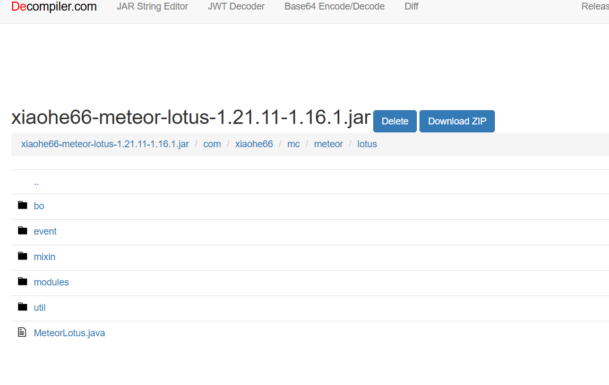
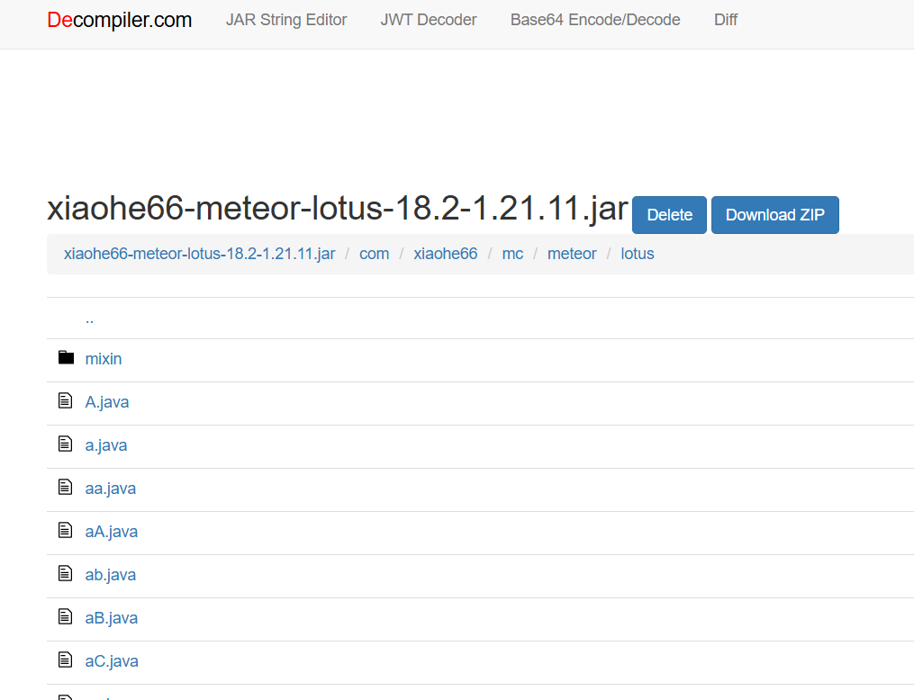

# 反編譯 Lotus
編輯於2026/9/12
即便Lotus在新版本添加了混淆，但在Codex、Gemini、Opencode、DeepSeek及能工智人的相互協作下，仍舊完成了對Lotus 18.2的反混淆，並一樣將其升級到了26.1.2版本。本次反混淆的示範意義大於實際意義，演示了混淆並不能阻止本人反編譯，若有其他人未來想反混淆Lotus新版本，本專案亦可作為參照。而由於反編譯工程量極大，未來將不會繼續對Lotus新版本進行全面的反混淆，而會改成從現有版本做修改，並考慮將一些新版本Lotus的功能移植到目前Lotus 18.2的基礎上。

-------------------------------------------------------------------------------------------------------
編輯於2026/8/7
由於發現新版本Lotus添加了額外的混淆(如下圖)，因此本專案改為公開。

Lotus 1.16.1版本

Lotus 18.2版本

-------------------------------------------------------------------------------------------------------
編輯於2026/5/27 
本專案暫時不會公開，但如果未來發現官方Lotus加入了額外的混淆，本專案會立即公開。

## License

本專案基於Lotus 1.16.0版本的jar反編譯，經歷了反編譯、反混淆、改yarn mapping為Mojang mapping、更新至26.1.2等多個步驟，工程量不亞於一個小型模組。因此雖然本專案基於尊重原作者暫不開源，但若原作者後續加入了額外的混淆堵死了未來反編譯的窗口，本專案將不得不拋棄對原作者的尊重而立即開源。
